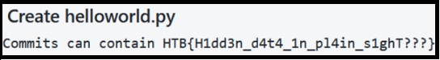

# Git Commit

**Category**: OSINT

**Points**: 225pts

**Description:** Are you really committed to becoming an OSINT master? Because version-control and collaboration platforms may expose valuable information and Jonathan is using one of them.

**Solution:**
Based on the title and description the first place that came to mind was GitHub. Searching for Jonathan's email and twitter handler @j0nathanwither5 produced a repo. And checking in detail each of the commits gave us the flag **HTB{H1dd3n_d4t4_1n_pl41n_s1ghT???}**.

  

Commit details with the flag.

