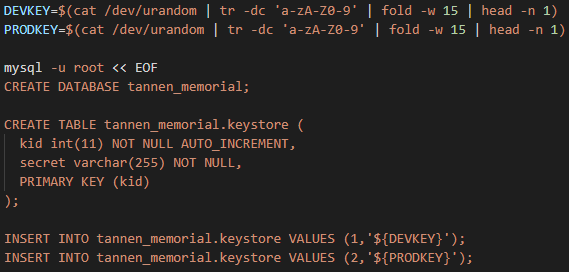
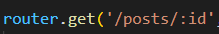
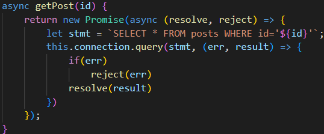
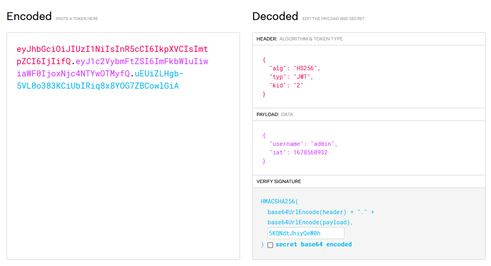
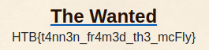

# MadDog Memorial

**Category**: Web

**Points**: 350pts

**TL;DR:** SQLi in the /posts/:id endpoint to get the secret key to forge our own admin JWT token. 💾💉🔑🎨

**Sources**:  [sources_web_maddog_memorial.zip](./sources_web_maddog_memorial.zip)

**Solution:**

Checking the source code we noticed that the flag was read from a file and only displayed in the webapp if the user was an admin, which the application determined by comparing the username set in the session JWT token against the "admin" string.

As we noticed in the entrypoint.sh file that the key was just 15 characters long and saved in the DB we initially though about brute-forcing the HS256 JWT token. However, we soon realized that even what is considered a weak key was to strong for us to break. So we moved on to look for other attack vectors. 

  

JWT key random generation and storage.

We then realized that the ***/posts/:id endpoint was be vulnerable*** as it passed the id parameter to a DB query that lacked prepared statements, parametrization, or sanitation.

  

Endpoint with the vulnerable parameter.

  

DB query without a prepared statement, parametrization or sanitation.

With that knowledge, we used sqlmap to perform an SQLi in the DB and dump the keystore table, obtain the PRODKEY secret for "kid 2", and with it forged our own admin token.

	sqlmap -r maddog.txt -D tannen_memorial -T keystore -C kid,secret --dump

Keystore table dump: 
| kid | secret          | 
| --- | --------------- |
| 1   | HKB8pmSesIcctQp |
| 2   | 5KQNdtJhiyQeW0h |

  

Forging an admin JWT token.

Finally, calling the "/" endpoint of the webapp using that session token returned the flag **HTB{t4nn3n_fr4m3d_th3_mcFly}**.

  

The wanted flag displayed in the webapp.

