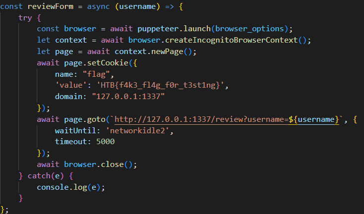
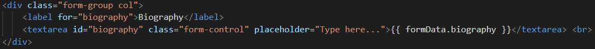

**Category**: Web

**Points**: 350pts

**TL;DR:** XSS to exfiltrate the cookie with the flag, which was set by the bot and puppeteer. 🚩🍪💻➡️📨

**Sources**:  [sources_web_solid_recruit.zip](./sources_web_solid_recruit.zip)

**Solution:**
Checking the sources provided with the challenge, we saw that sending an enrollment form triggered a review process and launched a puppeteer's browser with the flag cookie.

  

Review process were the flag cookie is set.

In this case we imagined puppeteer as an "end user" invoking the ***/review*** endpoint from its own browser. And if this /review call was susceptible to XSS attacks, extracting the flag cookie (which only existed in that browser) was possible. 

Analyzing the rest of the sources we found that the ***biography text area in the dashboard.html*** was not properly sanitized and was also used in the /review endpoint mentioned above. Just what we needed to launch our XSS attack.

  

Vulnerable biography text area.

After multiple attempts to exfiltrate the cookie, we ended up creating a simple Flask web application with a single endpoint that could be called using a parameter.

Finally, by writing the following script in the biography text area and sending the enrollment form,  we triggered the review process and puppeteer called our webapp with its cookies as a parameter, which we received and logged on our server. Getting the flag: **HTB{attr1but3s_4r3_m34nt_t0_b3_3sc4p3d}**.

**XSS:**

		</textarea> 
		
		<textarea></textarea>
