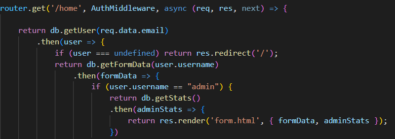
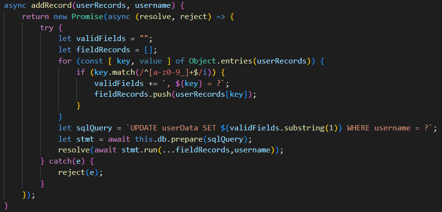

**Category**: Web

**Points**: 350pts

**TL;DR:** add extra fields to the body of a request so they are written to the DB and allow us to bypass the authorization/authentication checks. 📃✏️💾🔀👥

**Sources**:  [sources_web_vax_register.zip](./sources_web_vax_register.zip)

**Solution:**
Both the form.html and the database.js suggested that the flag was going to be in the admin stats. And to get to this view, we needed the /home endpoint to recognize us as an admin. In this case, and admin was determined by comparing the user.username against the "admin" string, and this user came from querying the DB using the ***req.data.email*** found in the session cookie.

So it went something like: 
		
	Session cookie (JWT Token) --> email --> DB User --> admin?

  

Path to the admin stats.

Analyzing the code we saw that **the login created the session token was created using the email of the user, not the username.***  Therefore, that having a user with the admin's email, found in the database.js, would be enough to impersonate the admin account. 

The /api/register endpoint writes a new user to the userData table, but it does not allow us to create a new user with an email that has already been used. Therefore, we looked for alternative ways to bypass this restriction. 

In that search is that we noticed that ***the "addRecord" function was also writing to the userData table using a prepared statement, but the parameters for it were dynamically put together*** from the Json data passed to the /api/enroll endpoint.

  

Vulnerable creation of the DB query based on the Json data.

Knowing that, we created a new user and used it to make a call to the /api/enroll endpoint. In this call however, we added an extra email field in the request body, which was not present in the original webapp form. 

	{
		.
		.
		.
	 "email" : "admin@vax-prereg.gov"
		.
		.
		.
	}

This value was written to the database together with the regular enrollment information, and after successfully logging in with our non-admin user, we were able to see the admin stats view and obtain the flag: **HTB{h0rizontal_priv3sc_pwn4g3!}**
